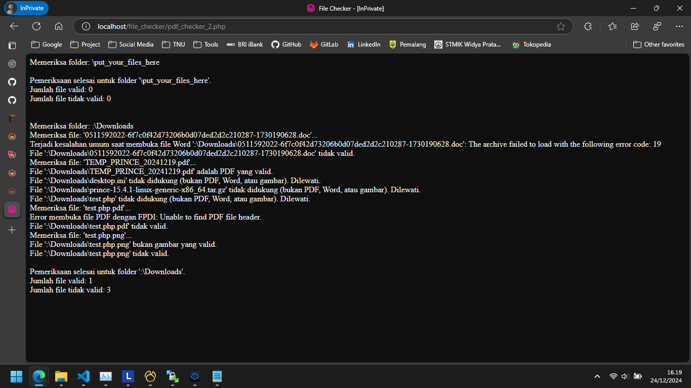

# File Checker

**File Checker** adalah aplikasi PHP untuk memeriksa validitas file berdasarkan tipe sebenarnya (real type) dari file, bukan hanya berdasarkan ekstensi atau MIME type. Aplikasi ini dirancang untuk memvalidasi tiga jenis file utama:

-   **PDF**: Memeriksa apakah file benar-benar PDF yang valid.
-   **Word Documents**: Memeriksa apakah file adalah dokumen Word yang valid, baik dalam format `.doc` (Word 97-2003) maupun `.docx` (Word 2007+).
-   **Images**: Memeriksa apakah file adalah gambar yang valid (JPEG, PNG, GIF, WebP).



## Fitur Utama

1. **Validasi Tipe File**:
    - Aplikasi ini tidak hanya mengandalkan ekstensi file atau MIME type, tetapi juga memeriksa isi file untuk memastikan bahwa file tersebut sesuai dengan format yang seharusnya.
2. **Dukungan Multi-Format**:

    - **PDF**: Memanfaatkan pustaka [FPDI](https://www.setasign.com/products/fpdi/) untuk memverifikasi PDF.
    - **Word Documents**: Menggunakan [PHPWord](https://github.com/PHPOffice/PHPWord) untuk memverifikasi file `.doc` dan `.docx`.
    - **Images**: Menggunakan fungsi bawaan PHP `getimagesize()` untuk memverifikasi gambar.

3. **Pemeriksaan Massal**:
    - Memeriksa file dalam folder tertentu dan menghasilkan laporan mengenai file mana yang valid dan tidak valid.

## Cara Menggunakan

1. **Persyaratan**:

    - PHP 7.4 atau lebih baru.
    - Composer untuk mengelola dependensi.

2. **Instalasi**:

    - Clone repository ini:
        ```bash
        git clone https://github.com/hofarismail/file_checker.git
        ```
    - Masuk ke direktori proyek:
        ```bash
        cd file_checker
        ```
    - Instal dependensi melalui Composer:
        ```bash
        composer install
        ```

3. **Menjalankan Aplikasi**:

    - Pastikan folder yang ingin diperiksa sudah tersedia, misalnya: `put_your_files_here`.
    - Jalankan script PHP di server lokal:
        ```bash
        php -S localhost:8000
        ```
    - Atau jalankan langsung melalui command line:
        ```bash
        php file_checker.php
        ```

4. **Konfigurasi Folder**:
    - Ubah path folder yang ingin diperiksa dalam file script:
        ```php
        $foldersToCheck = [
            __DIR__ . DIRECTORY_SEPARATOR . 'put_your_files_here',
            'C:' . DIRECTORY_SEPARATOR . 'Downloads'
        ];
        ```

## Dukungan Format File

| Jenis File | Validasi                                                     |
| ---------- | ------------------------------------------------------------ |
| **PDF**    | Menggunakan pustaka FPDI untuk validasi.                     |
| **Word**   | `.doc` dan `.docx` divalidasi dengan PHPWord.                |
| **Images** | JPEG, PNG, GIF, dan WebP divalidasi dengan `getimagesize()`. |

## Catatan

-   Validasi dilakukan berdasarkan tipe sebenarnya (real type) file, sehingga file dengan ekstensi yang salah akan terdeteksi.
-   Jika ada file yang tidak valid, aplikasi akan memberikan pesan error yang spesifik untuk membantu Anda mengidentifikasi masalah.

## Kontribusi

Kontribusi sangat diterima! Jika Anda memiliki ide untuk meningkatkan aplikasi ini, silakan buat pull request atau ajukan issue di repository ini.

---

Semoga bermanfaat! 😊
